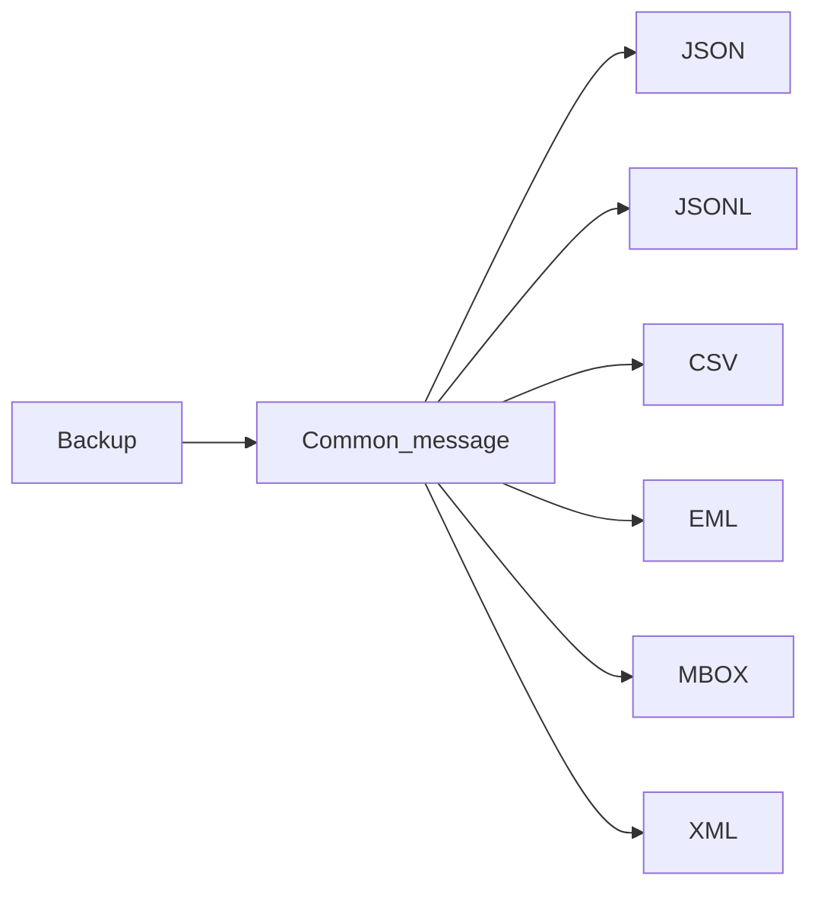

# Common message

Every exporter builds the same per-conversation structure before writing files. That structure is the **common message**: one structured conversation (participants, timestamps, text, attachment metadata, and source-specific extras) that all packaging formats share.

JSON is the default on-disk packaging of the common message. CSV, EML, MBOX, JSON Lines, and XML are other packaging choices projected from it—not separate parse pipelines.

## Workflow (one Run)

On the Message tab (or any exporter CLI):

1. Choose the backup source.
2. Choose an **output format** (default **JSON**).
3. Run once.

Internally the app always does two stages:

```text
Backup / source
    → common message (per conversation)
    → packaging (JSON | JSONL | CSV | EML | MBOX | XML)
```

You pick the packaging once. You do **not** need to export JSON and then open Re-export for a normal first export.



## Why JSON is the default

JSON (and JSON Lines) store the common message with the least loss for later conversion. Prefer JSON when you may re-package later or want a machine-readable archive. Prefer CSV, EML, MBOX, or XML when the next tool needs that packaging now.

## Re-export

[Re-export between formats](reexport.md) is for an **existing** Message Exporters output folder: read conversations back into the common message, then write another format. It is not required for the first export from a phone backup.

## See also

- [Formats in detail](formats.md)
- Schema and field details for contributors: [COMMON_MESSAGE.md](../COMMON_MESSAGE.md) (crate still named `message-ir`)
